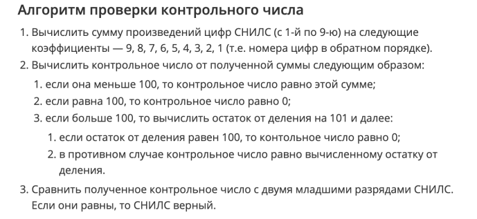

# YLab_Tasks homework02

* Для каждой задачи реализовать отдельный класс с методом main, в котором
демонстрируется работа решения.

# Sequences
Последовательности A - J заданы в виде нескольких значений следующим образом

* A. 2, 4, 6, 8, 10... 
* B. 1, 3, 5, 7, 9...
* C. 1, 4, 9, 16, 25...
* D. 1, 8, 27, 64, 125...
* E. 1, -1, 1, -1, 1, -1...
* F. 1, -2, 3, -4, 5, -6...
* G. 1, -4, 9, -16, 25...
* H. 1, 0, 2, 0, 3, 0, 4...
* I. 1, 2, 6, 24, 120, 720...
* J. 1, 1, 2, 3, 5, 8, 13, 21...

Необходимо найти закономерности, по которым эти последовательности
сформированы и реализовать следующий интерфейс, каждый метод которого
принимает число N и выводит в консоль N элементов соответствующей
последовательности. Каждый элемент можно выводить с новой строки. 

# Complex Numbers

Реализовать класс, описывающий комплексное число (действительная и мнимая часть
должны иметь точность double). Должны быть доступны следующие операции:
1. Cоздание нового числа по действительной части (конструктор с 1
   параметром)
2. Создание нового числа по действительной и мнимой части (конструктор
   с 2 параметрами)
3. Сложение
4. Вычитание
5. Умножение
6. Операция получения модуля
7. преобразование в строку (toString)
   
Арифметические действия должны создавать новый экземпляр класса. Написать код,
демонстрирующий работу с созданными классами 

# RateLimitedPrinter

Реализовать класс RateLimiterPrinter. Класс имеет конструктор, в который передается
<b>interval</b> и метод <b>print()</b>, в который передается строка.  
Класс функционирует по
следующему принципу: на объекте класса вызывается метод <b>print()</b>. Далее идет
проверка, когда был последний вывод в консоль. Если интервал (в миллисекундах)
между последним состоявшимся выводом и текущим выводом больше значения
<b>interval</b>, переданного в конструктор, то происходит вывод значения. Иначе - не
происходит, и сообщение отбрасывается. То есть класс ограничивает частоту вывода в
консоль. Другими словами, сообщение не будет выводится чаще чем 1 раз в <b>interval</b>
милисекунд. Реализовать описанный класс.

# Snils Validator

Номер СНИЛС состоит из 11 цифр, и валидация номера СНИЛС выполняется по
следующим правилам: 
  
Реализовать интерфейс SnilsValidator, который возвращает true если номер СНИЛС валидный, 
false - в противном случае.

# StatsAccumulator

Необходимо реализовать интерфейс StatsAccumulator. Объект данного класса, будучи созданным, 
может принимать значения через метод <b>add()</b>. Приняв значение, объект меняет свое 
внутреннее состояние, чтобы в любой момент времени предоставить данные о количестве переданных 
ему элементов, минимальному из них, максимальному из них, а также о среднем арифметическом
всех переданных ему элементов. 
Написать решение, использующее O(1) памяти. Другими словами - нельзя хранить все
переданные в метод <b>add()</b> числа.