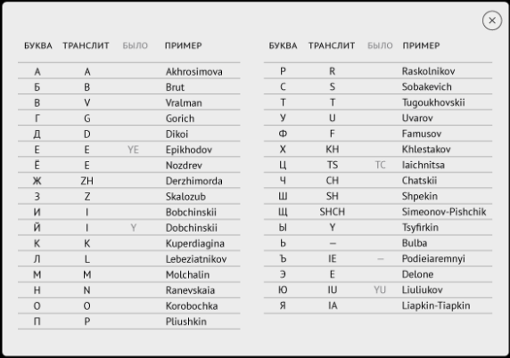
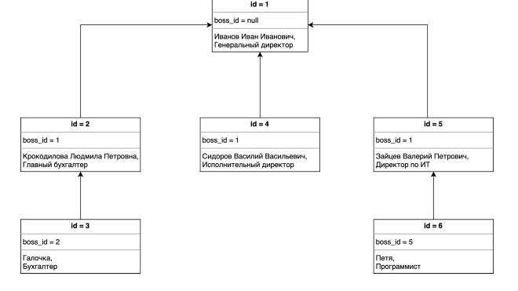

# YLab_Tasks homework03

# Transliterator

Правила транслитерации приведены в таблице ниже (колонки БУКВА и ТРАНСЛИТ):  
  
Реализовать интерфейс <b>Transliterator</b>  

`public interface Transliterator { String transliterate(String source); }`  

Метод transliterate должен выполнять транслитерацию входной строки в выходную, то
есть заменять каждый символ кириллицы на соответствующую группу символов
латиницы. Каждый символ кириллицы, имеющийся во входной строке входит в нее в
верхнем регистре.

# DatedMap

<b>DatedMap</b> - это структура данных, очень похожая на Map, но содержащая
дополнительную информацию: время добавления каждого ключа. При этом время
хранится только для тех ключей, которые присутствуют в Map.
Реализовать <b>DatedMap</b> путем реализации следующего интерфейса

`public interface DatedMap {`    
` void put(String key, String value);`  
` String get(String key);`  
` boolean containsKey(String key);`  
` void remove(String key);`  
` Set<String> keySet();`  
` Date getKeyLastInsertionDate(String key);`  
`}`   

<b>Методы:</b>  
<b>put:</b> Помещает в map пару ключ и значение. Как видно из описания метода, ключ и
значение - это строки (семантика Map#put)  
<b>get:</b> Возвращает значение, связанное с переданным в метод ключом. Если для
переданного ключа значение отсутствует - возвращается null (семантика Map#get)  
<b>containsKey:</b> Метод, проверяющий, есть ли в map значение для данного ключа
(семантика Map#containsKey).  
<b>remove:</b> Получая на вход ключ, удаляет из map ключ и значение, с ним связанное
(семантика Map#remove)  
<b>ketSet:</b> Возвращает множество ключей, присутствующее в map (семантика
Map#keySet)  
<b>getKeyLastInsertionDate:</b> Получая на вход ключ, проверяет, что для данного ключа
существует значение в map. Если существует - возвращает дату, когда оно было
добавлено. Если нет - возвращает null.  

В реализации данного класса можно использовать уже готовые структуры данных в
Java, такие как <b>HashMap</b>.  

# OrgStructure

Структура организации записана в виде строк в CSV файле. CSV - файл - это простой
текстовый файл, содержащий строки. Каждая строка представляет собой одну запись
(объект). Поля объекта разделены специальным символом <b>;</b>. Первая строка файла
содержит поля имена полей, все дальнейшие сроки содержат непосредственно
данные.  

Пример:  
`id;boss_id;name;position`  
`1;;Иван Иванович;Генеральный директор`  
`2;1;Крокодилова Людмила Петровна;Главный бухгалтер`  
`3;2;Галочка;Бухгалтер`  
`4;1;Сидоров Василий Васильевич;Исполнительный директор`  
`5;1;Зайцев Валерий Петрович;Директор по ИТ`  
`6;5;Петя;Программист`  

В файле поле <b>id</b> обозначает уникальный идентификатор сотрудника, <b>boss_id</b>
идентификатор начальника, <b>name</b> - имя сотрудника, <b>position</b> - должность. Таким
образом, данные в файле описывают следующую иерархию сотрудников:

Необходимо написать программу, получает на вход CSV файл формата, описанного
выше и формирует структуру объектов класса <b>Employee (Сотрудник)</b>. Решение оформить в виде реализации следующего 
интерфейса:  

`public interface OrgStructureParser {
public Employee parseStructure(File csvFile) throws IOException;
}`

Метод <b>parseStructure</b> должен считывать данные из файла и возвращать ссылку на
Босса (Генерального директора) - сотрудника, атрибут <b>boss_id</b> которого не задан.
Cчитать, что такой сотрудник в файле ровно один.
P.S. <b>subordinates</b> - список прямых подчиненных.  

# PasswordValidator

1. Создать статический метод, который принимает на вход три параметра: <b>login</b>,
   <b>password</b> и <b>confirmPassword</b>.
2. <b>Login</b> должен содержать только латинские буквы, цифры и знак подчеркивания.
   Если <b>login</b> не соответствует - выбросить <b>WrongLoginException</b> с текстом “Логин
   содержит недопустимые символы”
3. Длина <b>login</b> должна быть меньше 20 символов. Если <b>login</b> не соответствует этим
   требованиям, необходимо выбросить <b>WrongLoginException</b> с текстом “Логин
   слишком длинный”
4. <b>Password</b> должен содержать только латинские буквы, цифры и знак
   подчеркивания. Если password не соответствует этим требованиям, необходимо
   выбросить <b>WrongPasswordException</b> с текстом “Пароль содержит недопустимые
   символы”
5. Длина <b>password</b> должна быть меньше 20 символов. <b>Если password</b> не
   соответствует этим требованиям, необходимо выбросить
   <b>WrongPasswordException</b> с текстом “Пароль слишком длинный”
6. Также <b>password</b> и <b>confirmPassword</b> должны быть равны. Если password не
   соответствует этим требованиям, необходимо выбросить
   <b>WrongPasswordException</b> с текстом “Пароль и подтверждение не совпадают”
7. <b>WrongPasswordException</b> и <b>WrongLoginException</b> - пользовательские классы
   исключения с двумя конструкторами – один по умолчанию, второй принимает
   сообщение исключения и передает его в конструктор класса Exception.
8. Обработка исключений проводится внутри метода. Обработка исключений -
   вывод сообщения об ошибке консоль
9. Метод возвращает <b>true</b>, если значения верны или <b>false</b> в другом случае.  

# FileSort

Даны следующие классы:
* Класс <b>Generator</b>, которые генерирует файл с заданными количеством чисел типа long
* Класс <b>Validator</b>, который проверяет, что файл отсортирован по возрастанию
* Класс <b>Sorter</b>, который получает на вход файл с числами, и возвращает
  отсортированный по возрастанию файл  
* И класс <b>Test</b>, который запускает генерацию файла, затем сортировку и проверку, что
  файл отсортирован

Задача - реализовать метод <b>Sorter.sortFile</b> используя алгоритм внешней
сортировки слиянием.
Для демонстрации решения проверяющим можно использовать файл небольшого
размера (до 100 элементов), однако, решение долго быть реализовано таким образом,
чтобы поддерживать сортировку файлов произвольно большого размера.
Для самопроверки можно сгенерировать файл из 375000000 записей, тогда объем
файла, который надо будет отсортировать, будет равен 7-8 Гб