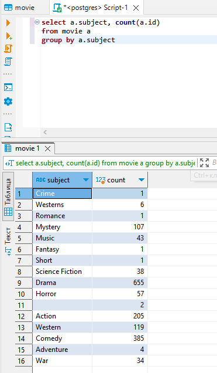
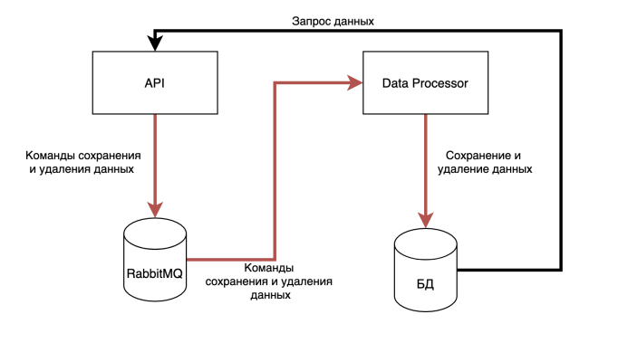
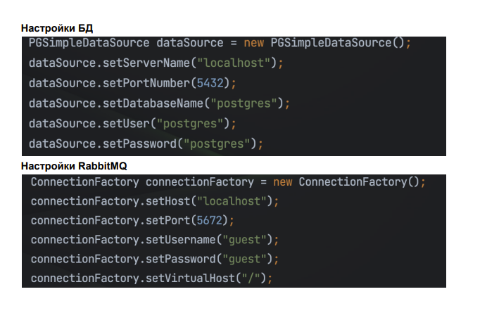

# Movie Database

Скачать файл https://perso.telecom-paristech.fr/eagan/class/igr204/data/film.csv
В файле содержать данные о фильмах
Необходимо
1. Реализовать код, читающий данные из файла и записывающий в таблицу через
   JDBC. Для добавления данных использовать <b>PreparedStatement</b>.
   В работе необходимо использовать следующий класс:  
   `   class Movie { `  
   `   private Integer year; `  
   `   private Integer length; `  
   `   private String title; `  
   `   private String subject; `  
   `   private String actors; `  
   `   private String actress; `  
   `   private String director; `  
   `   private Integer popularity; `  
   `   }`` 

Данные, считываемые из файла должны быть упакованы в экземпляр 
указанного класса. Затем этот экземпляр должен передаваться коду, который 
будет отвечать за сохранение данных в БД. Обратить внимание, что в файле 
могут некоторые значения могут отсутствовать. В таком случает надо 
вызывать <b>preparedStatement.setNull(<index>, java.sql.Types.<тип>)</b>

2. Для созданной таблицы написать запрос, выводящий количество фильмов
   каждого жанра (<b>GROUP BY</b>). Запрос написать в комментариях к коду решения:  

# Persistent Map

Необходимо реализовать <b>Map</b>, хранящий свое состояние исключительно в базе
данных. То есть, любое изменение данных <b>Map</b> (добавление и удаление), а также
получение данных должно транслироваться в соответствующие SQL запросы.  
<b>name</b> - имя экземпляра <b>Map</b>  
<b>key</b> - ключ в экземпляре <b>Map</b>  
<b>value</b> - значение, соответствующее ключу в текущем экземпляре <b>Map</b>.  

Реализация состоит в реализации следующего интерфейса:   

`public interface PersistentMap { `  
`void init(String name, DataSource dataSource); `  
`boolean containsKey(String key) throws SQLException; `  
`List<String> getKeys() throws SQLException; `  
`String get(String key) throws SQLException; `  
`void remove(String key) throws SQLException; `  
`void put(String key, String value) throws SQLException; `  
`void clear() throws SQLException; `  
`} `  

<b>init</b> - метод используется для инициализации нового экземпляра <b>Map</b>. Принимает 2
параметра: имя текущего экземпляра и <b>DataSource</b> для подключения в БД. Данные
всех экземпляров хранятся в одной таблице, и имя используется для того, чтобы
отделять данные одного экземпляра от данных другого.  
<b>containsKey</b> - возвращает <b>true</b> тогда и только тогда, когда существует значение,
связанное с данным ключом, <b>false</b> - в противном случае.  
<b>getKeys</b> - возвращает список ключей, для которых есть значения в БД.  
<b>get</b> - возвращает значение, связанное с переданным ключом.  
<b>remove</b> - удаляет пару ключ/значение из <b>Map</b>.  
<b>put</b> - служит для добавления новой пары ключ-значение. В своей работе сначала
удаляет существую пару из <b>Map</b> (если она есть), а затем добавляет новую.  
<b>clear</b> - удаляет все данные из текущего экземпляра <b>Map</b>.  

<b>Допущение:</b> можно считать, что одновременно только одно приложение будет
работать с конкретным экземпляром. То есть, соблюдение строгой транзакционности и
реализация многопоточной работы не обязательны!
Создание таблицы производится отдельно. То есть в код создание таблицы добавлять
не нужно!  

# FileSort Returns!

Реализовать интерфейс  

`public interface FileSorter {
File sortFile(File dataFile) throws Exception;
}`  

Реализация интерфейса получает на вход файл, состоящий из чисел (long),
разделенных переносом строки и возвращает файл, в котором эти числа
отсортированы в порядке убывания.

1. Можно считать, что максимальный размер файла - 1000000 чисел
2. Сортировку необходимо реализовать средствами БД
3. Работа с БД - средствами JDBC
4. При вставке данных обязательно использовать batch-processing. Разобраться
   что это такое, для чего используется и как реализовать
5. Необязательно. Реализовать версию без batch-processing, сравнить
   производительность
   Создание таблицы должно быть произведено следующим скриптом
   `CREATE TABLE numbers ( val bigint );`  

# Event Sourcing  

Написать 2 приложения, реализующие функционал асинхронной записи данных в БД.
Приложение оперирует классом <b>Person</b>, содержащий данные о людях.

`class Person { `  
`private Long id; `  
`private String name; `  
`private String lastName; `  
`private String middleName; `  
`// Getters, Setters, Constructor `  
`} `  

Задача состоит из написание двух приложения, одно из которых содержит реализацию
интерфейса взаимодействия с системой, второе - для взаимодействия с БД.  
Архитектура представлена ниже

  

* <b> Приложение DataProcessor </b>

Принимает из RabbitMQ сообщения о добавлении/удалении данных, затем выполняет
в БД соответствующие запросы. Необходимо, чтобы сообщения, отправленные первыми, обрабатывались также
первыми (чтобы принцип FIFO не нарушался).

* <b>Приложение API</b>

Приложение содержит реализацию следующего интерфейса:

`public interface PersonApi { `  
`void deletePerson(Long personId); `  
`void savePerson(Long personId, String firstName, String lastName, `  
`String middleName); `  
`Person findPerson(Long personId); `  
`List<Person> findAll(); `  
`} `  

1. <b>deletePerson</b> генерирует сообшение-команду на удаление персоны с заданным
   id. Далее это сообщение должно быть обработано соответствующим запросом,
   выполняя удаление данных. Если данных для определенного personId не
   найдено - выводить в лог сообщение, что была попытка удаления, но при этом
   данные не найдены. Exception или другую ошибку не выдавать.  
2. <b>savePerson</b> генерирует сообщение-команду на сохранение данных персоны.
   Обработчик должен проверить, существует ли в БД персона с переданным
   personId. Если существует - необходимо выполнить обновление данных
   (обновить три поля <b>firstName</b>, <b>lastName</b>, <b>middleName</b>). Если не существует -
   создать персону с переданным <b>personId</b>.
3. <b>findPerson</b> генерирует запрос напрямую в БД и возвращает данные персоны,
   если персона для данного personId найдена, null в противном случае
4. <b>findAll</b> генерирует запрос напрямую в БД и возвращает данные о <b>ВСЕХ</b>
   сохраненных в базе персонах.  
   
<b>Замечания по реализации</b>   
1. Формат сообщений для сохранения и удаления данных разработать
   самостоятельно
2. Создание таблицы - следующим скриптом  
   `create table person ( `  
   `person_id bigint primary key, `  
   `first_name varchar, `  
   `last_name varchar, `  
   `middle_name varchar `  
   `)`  
3. Приложения можно разрабатывать в одном пакете, просто с двумя классами, в
   которых есть метод <b>main(String[].. args)</b>. Тогда запуск каждого приложения - 
   запуск соответствующего класса.  
4. В случае возникновения ошибок и исключений - писать данные об этом в
   консоль.  
5. Контролировать случай, что запрос данных возможен только после обработки
   всех сообщений не надо никак! Методы поиска должны возвращать то, что есть
   в БД на текущий момент.  
6. Реализация остается на усмотрение студентов, проверка будет заключаться в
   проверке реализации интерфейса <b>PersonApi</b>.
7. Создание таблицы производится отдельно. То есть в код создание таблицы
   добавлять не нужно!  
8. В связи с тем, что проверяющие будут проверять данную задачу на своих
   окружения, необходимо использовать следующие параметры окружения. 
